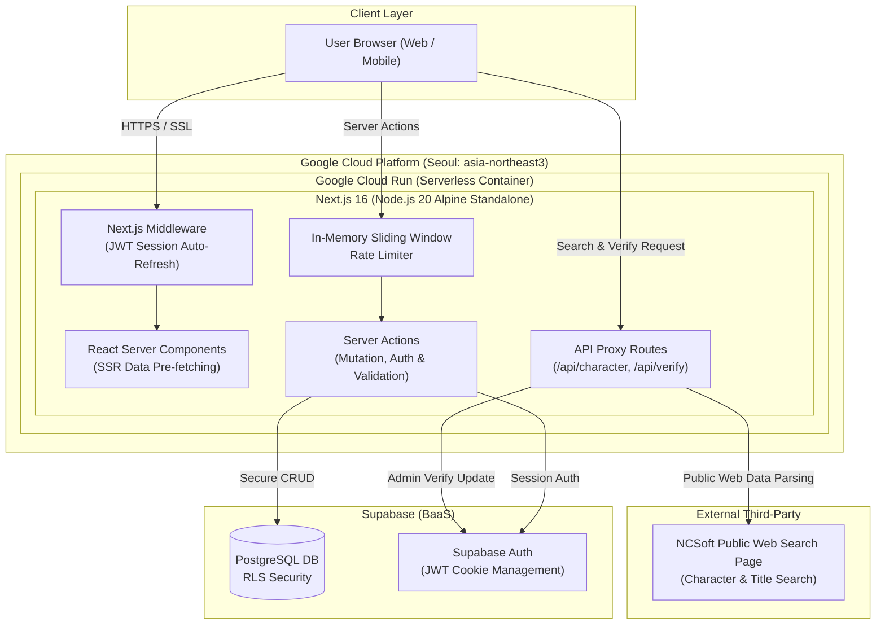
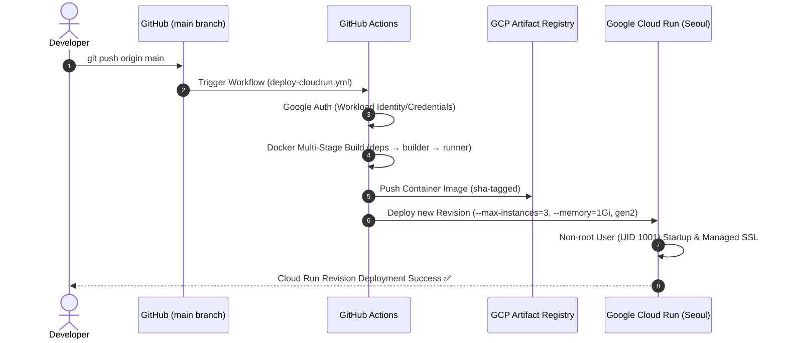
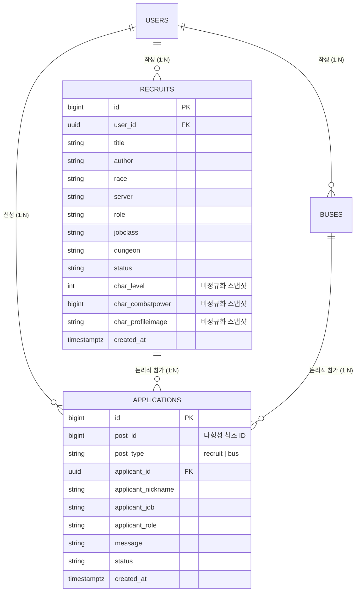

# Aion2-Matching Platform (MMORPG 매칭 & 캐릭터 데이터 연동 서비스)

<div align="center">


**N사 MMORPG 유저들을 위한 파티·버스 매칭 및 캐릭터 데이터 연동 플랫폼**<br/>
*컨테이너 기반 인프라 설계부터 백엔드 로직, 데이터 모델링, Rate Limiting, CI/CD 자동화까지 주도적으로 구축한 풀스택 프로젝트*

</div>

> **라이브 데모 중단 안내**
>
> 현재 클라우드 인프라(Google Cloud Run, Supabase) 유지 비용 관리 차원에서 **실제 서비스 운영 및 라이브 데모는 일시 중단된 상태**입니다.
> 본 저장소의 소스 코드와 본문의 아키텍처 다이어그램, 핵심 구현 요약을 통해 전체 시스템 구조와 트러블슈팅 내역을 확인하실 수 있습니다.

---

## 핵심 구현 요약
- **외부 데이터 연동**: 게임 홈페이지의 공개 캐릭터 검색 데이터 연동 및 비정규화 스냅샷 저장
- **데이터 모델링**: PostgreSQL (Supabase) 기반 사용자·모집글·신청 내역 관계형 데이터 모델링
- **트러블슈팅**: 클라이언트·서버 간 세션 쿠키 불일치로 인한 401 오류 분석 및 미들웨어 자동 갱신 파이프라인 구축
- **인프라 & CI/CD**: Docker 3단계 Multi-stage 최적화, GitHub Actions, Google Cloud Run 기반 자동 배포 환경 구축

---

## 목차
1. 프로젝트 개요 & 핵심 기능
2. 시스템 아키텍처
3. 인프라 & CI/CD 배포 파이프라인
4. 핵심 백엔드 엔지니어링 & 트러블슈팅
5. 데이터베이스 모델링 & 캐싱 전략
6. AI 에이전트 기반 품질 관리 및 리뷰 파이프라인
7. 프로젝트 디렉토리 구조
8. 로컬 실행 가이드

---

## 1. 프로젝트 개요 & 핵심 기능

아이온2(Aion2) 유저들이 게임 내 인스턴스 던전, 어비스 레이드, 버스(기사/승객)를 원활하게 구성할 수 있도록 지원하는 매칭 웹 플랫폼입니다.

- **캐릭터 전적 검색 & 스펙 조회**:
  - 공개 웹 데이터를 백엔드 프록시로 파싱하여 캐릭터 아바타, 레벨, 직업, 아이템 레벨, 종합 전투력을 시각화.
- **특정 칭호 기반 캐릭터 확인 기능**:
  - 게임 홈페이지의 공개 캐릭터 검색 결과에서 특정 칭호(`[카이시넬/지켈의 근원을 마주하다]`) 장착 여부를 대조해, 사용자가 입력한 캐릭터 정보를 확인하고 확인 뱃지를 부여.
- **파티원(구인/구직) 및 버스(기사/승객) 다형성 매칭**:
  - 종족, 서버, 역할군(탱/딜/힐), 던전 부류별 다중 조건 필터링 및 참가 신청/취소 관리.
- **다크 네온 게이밍 테마 & 반응형 UI**:
  - Tailwind CSS v4 기반의 사이언/앰버 네온 글래스모피즘 인터페이스 및 모바일 최적화.

---

## 2. 시스템 아키텍처



---

## 3. 인프라 & CI/CD 배포 파이프라인



### 인프라 엔지니어링 포인트
1. **3단계 Multi-stage Dockerfile 경량화 (`Dockerfile`)**:
   - `deps` ➔ `builder` ➔ `runner` 단계 분리로 빌드 도구와 불필요한 파일 배제.
   - `output: "standalone"` 설정을 통해 최소 번들만 복사하여 컨테이너 이미지 크기 대폭 축소 및 콜드 스타트 지연 최소화.
2. **컨테이너 프로세스 보안 격리**:
   - `nextjs:nodejs` (UID/GID 1001) 비루트(Non-root) 전용 시스템 계정으로 실행하여 컨테이너 프로세스의 권한 범위를 제한.
3. **환경 변수 계층 분리 주입**:
   - 공개 클라이언트 변수(`NEXT_PUBLIC_*`)는 빌드 타임(`ARG`)에 주입.
   - 백엔드 마스터 키(`SUPABASE_SERVICE_ROLE_KEY`)는 이미지 레이어에 남지 않도록 빌드 인자에서 완전 배제하고, Cloud Run 런타임 환경변수(`--env_vars`)로 안전하게 주입.
4. **비용 통제 및 가용성 설정**:
   - 서울 리전(`asia-northeast3`) 호스팅, 최대 인스턴스 3개 제한(`--max-instances=3`), 2세대 가속 환경(`--execution-environment=gen2`) 적용.

---

## 4. 핵심 백엔드 엔지니어링 & 트러블슈팅

### 1. 배포 환경에서 발생한 401 세션 쿠키 불일치 문제 해결
- **문제 (Symptom)**: 클라이언트에서 로그인 성공 후 Server Action 호출 시 간헐적으로 `로그인이 필요합니다 (401)` 오류 발생.
- **원인 (Root Cause)**: 기존 라이브러리가 세션 토큰을 `localStorage`에만 저장하여, HTTP 요청 헤더의 `Cookie`를 읽는 백엔드 Server Action으로 토큰이 전달되지 않음.
- **해결 (Action)**: `@supabase/ssr`의 `createBrowserClient`로 마이그레이션하여 쿠키 동기화를 구현하고, `src/middleware.ts`를 작성하여 라우트 진입 시 세션 갱신 처리를 수행하도록 파이프라인 구축.
- **결과 (Result)**: 세션 불일치 401 오류 해소 및 세션 만료 방지·클라이언트/서버 간 세션 연속성 개선.

### 2. 인메모리 슬라이딩 윈도우 Rate Limiter 자체 구현 (`src/lib/rate-limit.ts`)
- **문제 (Symptom)**: 외부 공개 웹 데이터 조회 호출 시 지연 발생 및 반복 요청으로 인한 외부 서비스 요청 증가와 서버 부담 완화 필요.
- **해결 (Action)**:
  - `Map<string, { count: number; expiresAt: number }>` 기반의 경량 메모리 레이트 리미터 직접 개발.
  - IP 및 유저 ID(`user.id`) 기준으로 엔드포인트별 세분화된 요청 제한 적용:
    - 캐릭터 검색 API: 1분당 5회 제한
    - 칭호 대조 확인 API: 1분당 1회 제한
    - 게시글/프로필 작성 Server Actions: 1분당 5~10회 제한
  - 제한 초과 시 즉각 `429 Too Many Requests`를 반환하고, 확률적 GC(`Math.random() < 0.1`)로 만료 키를 자동 정리하여 메모리 누수 방지.

> **인프라 확장성 고려사항 (Architecture Note)**:
> 현재 Rate Limiter는 경량 인메모리 방식으로 구현되어 단일 인스턴스 단위로 상태가 관리됩니다.
> 향후 다중 인스턴스 스케일아웃 환경에서 전역 요청 제한이 필요할 경우, Redis 등 외부 분산 저장소 기반 구조로 확장 가능합니다.

### 3. 서버사이드 다층 보안 및 데이터 무결성 검증
- **소유권 강제 대조**: 클라이언트에서 전송된 `user_id`를 신뢰하지 않고, 서버 세션(`auth.getUser()`)의 ID와 DB 레코드의 `user_id`를 대조하여 타인 글 변조 차단.
- **입력값 서버사이드 재검증**: 클라이언트 폼의 `maxLength` 우회 공격을 방지하기 위해 Server Action 계층에서 제목(100자), 본문(2000자) 길이 및 데이터 형식을 강제 검증.
- **보안 HTTP 헤더 강제 (`next.config.ts`)**: `X-Frame-Options: DENY`, `X-Content-Type-Options: nosniff`, `X-XSS-Protection` 적용.

---

## 5. 데이터베이스 모델링 & 캐싱 전략



- **외부 요청 감소를 위한 '비정규화 스냅샷' 컬럼 설계**:
  - 카드 목록 조회 시마다 외부 웹페이지를 다시 요청하지 않도록, 글 작성 시점의 캐릭터 정보(전투력 `char_combatpower`, 레벨, 프로필 이미지 URL)를 게시글 테이블에 비정규화된 스냅샷으로 저장해 외부 웹 요청을 줄이고 조회를 최적화.
- **다형성 연관(Polymorphic Association)**:
  - 파티글(`recruits`)과 버스글(`buses`)의 신청 내역을 `applications` 테이블 1개에서 `post_id`와 `post_type` 조합으로 게시글 유형을 구분하는 다형성 연관 구조로 통합 관리.

---

## 6. AI 에이전트 기반 품질 관리 및 리뷰 파이프라인

프로젝트 구조와 규칙을 먼저 파악한 뒤, 여러 관점에서 코드를 검토하도록 AI 코딩 에이전트의 작업 절차(`.agents`)를 구성했습니다. 결과는 개발자가 직접 검토하고 필요한 변경만 반영하는 **주도적 AI 협업 환경**을 구축했습니다.

- **`AGENTS.md` 4단계 정밀 검사 파이프라인**:
  1. `project-mapper`: 디렉토리 구조 및 핵심 진입점 지형도 파악
  2. `issue-finder`: 로직/타입/구조/보안/성능 5개 카테고리 이슈 후보 도출
  3. `Verifier 5종`: `logic`, `type`, `architecture`, `security`, `performance` 영역별 전문 검증기를 통한 교차 검증
  4. `inspection-reporter`: 선별된 이슈 종합 리포트 생성 및 개발자 최종 판단
- **트리거 키워드**: 채팅창에 `!정밀검사`, `!보안검사` 입력 시 사전 정의된 검사 워크플로우를 즉시 가동하여 코드 베이스 진단.
- **변경 이력 관리**: AI와의 협업을 통해 도출된 트러블슈팅 내역과 구조적 개선 사항을 개발자가 최종 승인 후 패치 노트(`CHANGELOG.md`)에 체계적으로 기록.

---

## 7. 프로젝트 디렉토리 구조

```
Aion2-Matching/
├── .agents/                    # AI 에이전트 하네스 규칙 및 서브에이전트 스킬 (10종)
├── .github/workflows/          # GitHub Actions CI/CD 파이프라인 (Cloud Run 배포)
├── public/                     # 정적 웹 애셋
├── scripts/                    # DB 마이그레이션 SQL 스크립트
│   └── sql/                    # 테이블 DDL 및 비정규화 캐싱 마이그레이션 쿼리
├── src/
│   ├── middleware.ts           # 세션 토큰 자동 갱신 미들웨어
│   ├── app/                    # Next.js 16 App Router (RSC & Server Actions)
│   │   ├── actions/            # 백엔드 Server Actions (recruit, profile, application)
│   │   ├── api/                # 백엔드 API Routes (캐릭터 검색, 칭호 확인)
│   │   ├── recruits/ & buses/  # 파티 및 버스 매칭 라우트
│   │   └── error.tsx & global-error.tsx # 글로벌 React Error Boundary
│   ├── components/             # 도메인별 UI 컴포넌트 (Hydration 방어 패턴 적용)
│   ├── constants/              # 서버 목록, 직업/역할군, 던전 목록
│   ├── contexts/               # Toast, Dialog 전역 UI 알림 컨텍스트
│   ├── lib/                    # Supabase Client/Server 분리, Rate Limiter
│   ├── types/                  # TypeScript 인터페이스 및 타입 가드 정의
│   └── utils/                  # 날짜 포맷팅, 모집 상태 계산 유틸리티
├── .dockerignore
├── .env.example                # 표준 환경 변수 템플릿 (플레이스홀더)
├── CHANGELOG.md                # 시맨틱 버전(v1.4.0~v1.0.0) 기반 패치노트 단일 아카이브
├── Dockerfile                  # 3단계 Multi-stage 최적화 도커 빌드 파일
├── eslint.config.mjs           # ESLint 9 설정 (0 errors, 0 warnings)
├── next.config.ts              # 보안 헤더, 이미지 도메인 허용, Standalone 설정
└── package.json
```

---

## 8. 로컬 실행 가이드

### 1) 환경 변수 설정 (`.env.local`)
```env
NEXT_PUBLIC_SUPABASE_URL=your_supabase_project_url
NEXT_PUBLIC_SUPABASE_ANON_KEY=your_supabase_anon_key
SUPABASE_SERVICE_ROLE_KEY=your_supabase_service_role_key
```

### 2) 설치 및 개발 서버 실행
```bash
# 의존성 설치
npm install

# 개발 서버 기동 (http://localhost:3000)
npm run dev

# 프로덕션 빌드 검증
npm run build
```

---

<div align="center">
  <sub>Designed & Developed with Passion by Dongwon Lee</sub>
</div>
